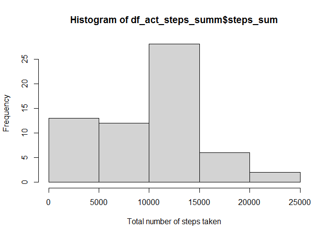
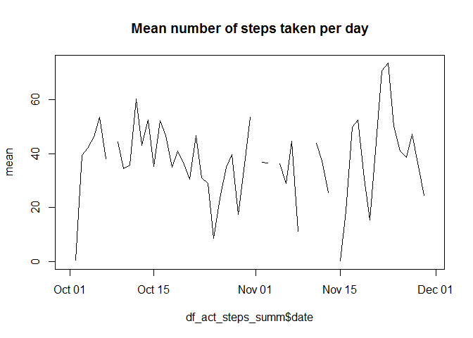
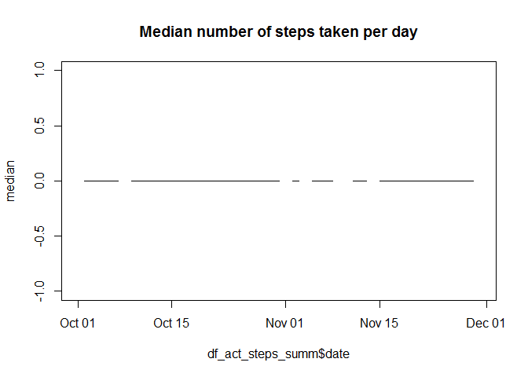
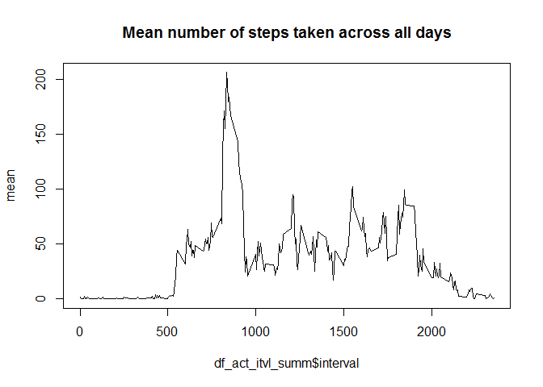
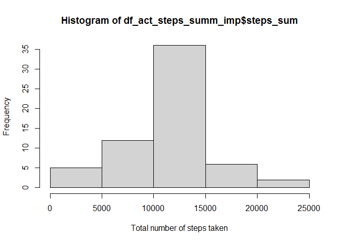
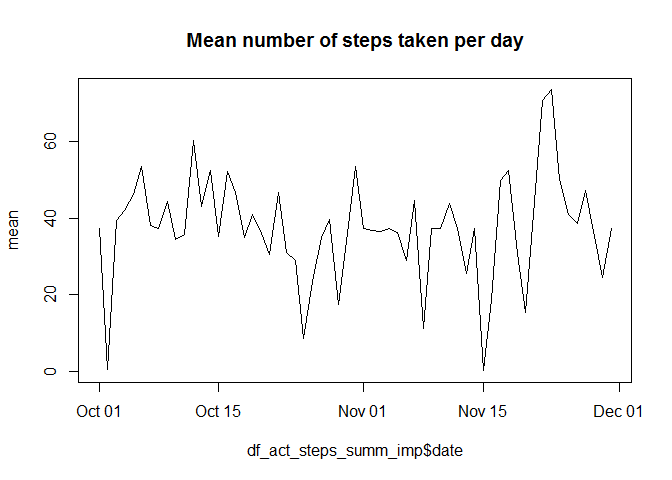
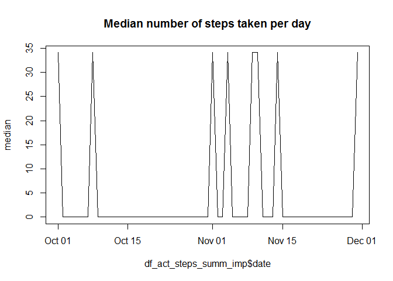
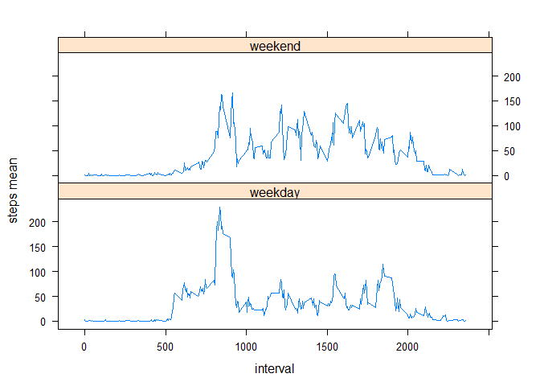

##Load libraries

```r
library(dplyr)
```

```
## 
## Attaching package: 'dplyr'
```

```
## The following objects are masked from 'package:stats':
## 
##     filter, lag
```

```
## The following objects are masked from 'package:base':
## 
##     intersect, setdiff, setequal, union
```

```r
library(lattice)
```


## Loading and preprocessing the data
### Set working directory

```r
getwd()
```

```
## [1] "C:/Users/SantibKa/repos/RepData_PeerAssessment1"
```

```r
setwd('C:/Users/SantibKa/repos/RepData_PeerAssessment1')
```
### Load the activity.csv file

```r
unzip('activity.zip')
df_act = read.csv('activity.csv')
str(df_act)
```

```
## 'data.frame':	17568 obs. of  3 variables:
##  $ steps   : int  NA NA NA NA NA NA NA NA NA NA ...
##  $ date    : chr  "2012-10-01" "2012-10-01" "2012-10-01" "2012-10-01" ...
##  $ interval: int  0 5 10 15 20 25 30 35 40 45 ...
```
### Convert to date from character

```r
df_act$date <- as.Date(df_act$date)
```


```r
summary(df_act)
```

```
##      steps             date               interval     
##  Min.   :  0.00   Min.   :2012-10-01   Min.   :   0.0  
##  1st Qu.:  0.00   1st Qu.:2012-10-16   1st Qu.: 588.8  
##  Median :  0.00   Median :2012-10-31   Median :1177.5  
##  Mean   : 37.38   Mean   :2012-10-31   Mean   :1177.5  
##  3rd Qu.: 12.00   3rd Qu.:2012-11-15   3rd Qu.:1766.2  
##  Max.   :806.00   Max.   :2012-11-30   Max.   :2355.0  
##  NA's   :2304
```


## What is mean total number of steps taken per day?

```r
df_act_steps_summ <- df_act %>% 
  group_by(date) %>% 
  summarise(steps_sum = sum(steps, na.rm = TRUE),
            steps_mean = mean(steps, na.rm = TRUE),
            steps_median = median(steps, na.rm = TRUE))
head(df_act_steps_summ)
```

```
## # A tibble: 6 x 4
##   date       steps_sum steps_mean steps_median
##   <date>         <int>      <dbl>        <dbl>
## 1 2012-10-01         0    NaN               NA
## 2 2012-10-02       126      0.438            0
## 3 2012-10-03     11352     39.4              0
## 4 2012-10-04     12116     42.1              0
## 5 2012-10-05     13294     46.2              0
## 6 2012-10-06     15420     53.5              0
```


### 1. Make a histogram of the total number of steps taken each day

```r
hist(df_act_steps_summ$steps_sum, xlab = "Total number of steps taken")  
```

<!-- -->
### 2. Calculate and report the mean and median total number of steps taken per day


```r
plot(df_act_steps_summ$date, df_act_steps_summ$steps_mean, type = 'l', main = "Mean number of steps taken per day", ylab = "mean")
```

<!-- -->

```r
plot(df_act_steps_summ$date, df_act_steps_summ$steps_median, type = 'l', main = "Median number of steps taken per day", ylab = "median")
```

<!-- -->


## What is the average daily activity pattern?

### 1. Make a time series plot (i.e. type = "l") of the 5-minute interval (x-axis) and the average number of steps taken, averaged across all days (y-axis)

```r
df_act_itvl_summ <- df_act %>% 
  group_by(interval) %>% 
  summarise(steps_mean = mean(steps, na.rm = TRUE),
            steps_median = median(steps, na.rm = TRUE))
head(df_act_itvl_summ)
```

```
## # A tibble: 6 x 3
##   interval steps_mean steps_median
##      <int>      <dbl>        <int>
## 1        0     1.72              0
## 2        5     0.340             0
## 3       10     0.132             0
## 4       15     0.151             0
## 5       20     0.0755            0
## 6       25     2.09              0
```

```r
plot(df_act_itvl_summ$interval, df_act_itvl_summ$steps_mean, type = "l", main = "Mean number of steps taken across all days", ylab = "mean")
```

<!-- -->


### 2. Which 5-minute interval, on average across all the days in the dataset, contains the maximum number of steps?

### The interval 835 contains the maximum number of steps

```r
df_steps_avg_max <- df_act_itvl_summ %>% filter(steps_mean == max(steps_mean)) 
head(df_steps_avg_max)
```

```
## # A tibble: 1 x 3
##   interval steps_mean steps_median
##      <int>      <dbl>        <int>
## 1      835       206.           19
```


## Imputing missing values
### 1. Calculate and report the total number of missing values in the dataset (i.e. the total number of rows with NAs)

### There's a total of 2304 missing values

```r
summary(df_act)
```

```
##      steps             date               interval     
##  Min.   :  0.00   Min.   :2012-10-01   Min.   :   0.0  
##  1st Qu.:  0.00   1st Qu.:2012-10-16   1st Qu.: 588.8  
##  Median :  0.00   Median :2012-10-31   Median :1177.5  
##  Mean   : 37.38   Mean   :2012-10-31   Mean   :1177.5  
##  3rd Qu.: 12.00   3rd Qu.:2012-11-15   3rd Qu.:1766.2  
##  Max.   :806.00   Max.   :2012-11-30   Max.   :2355.0  
##  NA's   :2304
```


### 2. Devise a strategy for filling in all of the missing values in the dataset. The strategy does not need to be sophisticated. For example, you could use the mean/median for that day, or the mean for that 5-minute interval, etc.
### 3. Create a new dataset that is equal to the original dataset but with the missing data filled in.

### The strategy for filling in all of the missing values was tot ake the mean for that 5 minute interval.

```r
df_act_imp <- inner_join(df_act_itvl_summ, df_act, by = "interval") %>% 
  mutate(imp_steps = ifelse(is.na(steps), steps_mean, steps)) %>% 
  select(steps = imp_steps, date, interval)
summary(df_act_imp)
```

```
##      steps             date               interval     
##  Min.   :  0.00   Min.   :2012-10-01   Min.   :   0.0  
##  1st Qu.:  0.00   1st Qu.:2012-10-16   1st Qu.: 588.8  
##  Median :  0.00   Median :2012-10-31   Median :1177.5  
##  Mean   : 37.38   Mean   :2012-10-31   Mean   :1177.5  
##  3rd Qu.: 27.00   3rd Qu.:2012-11-15   3rd Qu.:1766.2  
##  Max.   :806.00   Max.   :2012-11-30   Max.   :2355.0
```

### 4. Make a histogram of the total number of steps taken each day and calculate and report the mean and median total number of steps taken per day. 
### Do these values differ from the estimates from the first part of the assignment?
### Yes, they differ. The frequency of the total number of steps between 10,000 and 15,000 is 35.
### What is the impact of imputing missing data on the estimates of the total daily number of steps?
### 75% of the steps (third quartile) are below 27 instead of 12.

```r
df_act_steps_summ_imp <- df_act_imp %>% 
  group_by(date) %>% 
  summarise(steps_sum = sum(steps, na.rm = TRUE),
            steps_mean = mean(steps, na.rm = TRUE),
            steps_median = median(steps, na.rm = TRUE))
summary(df_act_steps_summ_imp)
```

```
##       date              steps_sum       steps_mean       steps_median   
##  Min.   :2012-10-01   Min.   :   41   Min.   : 0.1424   Min.   : 0.000  
##  1st Qu.:2012-10-16   1st Qu.: 9819   1st Qu.:34.0938   1st Qu.: 0.000  
##  Median :2012-10-31   Median :10766   Median :37.3826   Median : 0.000  
##  Mean   :2012-10-31   Mean   :10766   Mean   :37.3826   Mean   : 4.474  
##  3rd Qu.:2012-11-15   3rd Qu.:12811   3rd Qu.:44.4826   3rd Qu.: 0.000  
##  Max.   :2012-11-30   Max.   :21194   Max.   :73.5903   Max.   :34.113
```

```r
hist(df_act_steps_summ_imp$steps_sum, xlab = "Total number of steps taken")
```

<!-- -->

```r
plot(df_act_steps_summ_imp$date, df_act_steps_summ_imp$steps_mean, type = 'l',main = "Mean number of steps taken per day", ylab = "mean")
```

<!-- -->

```r
plot(df_act_steps_summ_imp$date, df_act_steps_summ_imp$steps_median, type = 'l',main = "Median number of steps taken per day", ylab = "median")
```

<!-- -->

## Are there differences in activity patterns between weekdays and weekends?

### Create a new factor variable in the dataset with two levels -- "weekday" and "weekend" indicating whether a given date is a weekday or weekend day.

```r
weekend <- c('Saturday', 'Sunday')
df_act_imp_wk <- df_act_imp %>% mutate(week_day_flag = ifelse(weekdays(date) %in% weekend, 'weekend', 'weekday')) %>%
  group_by(week_day_flag, interval) %>%
  summarise(steps_mean = mean(steps))
```

```
## `summarise()` has grouped output by 'week_day_flag'. You can override using the `.groups` argument.
```

```r
head(df_act_imp_wk)
```

```
## # A tibble: 6 x 3
## # Groups:   week_day_flag [1]
##   week_day_flag interval steps_mean
##   <chr>            <int>      <dbl>
## 1 weekday              0     2.25  
## 2 weekday              5     0.445 
## 3 weekday             10     0.173 
## 4 weekday             15     0.198 
## 5 weekday             20     0.0990
## 6 weekday             25     1.59
```


### Make a panel plot containing a time series plot (i.e. type = "l") of the 5-minute interval (x-axis) and the average number of steps taken, averaged across all weekday days or weekend days (y-axis).

```r
xyplot(steps_mean ~ interval | week_day_flag, data = df_act_imp_wk, type = "l", ylab = "steps mean", layout = c(1, 2))
```

<!-- -->

